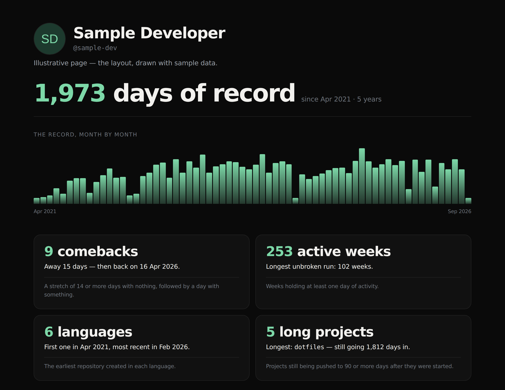

# TRUST Proof

**A résumé says what you claimed. This shows what you actually did.**

An AI writes a perfect résumé in two minutes. It cannot write ninety days of
yesterdays. TRUST Proof turns a public work record into one page you can send —
built from process patterns over time rather than a score.

```
https://trust-proof-nu.vercel.app/@your-handle
```

No sign-up, no install, nothing to connect. Public data only.



---

## What it shows

Four things a résumé cannot say, all of them **counts, never percentages**:

| Signal | How it is counted |
|---|---|
| **Days of record** | From the day the account opened until today |
| **Comebacks** | A stretch of 14+ days with nothing, followed by a day with something |
| **Active weeks** | Weeks holding at least one day of activity, and the longest unbroken run |
| **Languages, dated** | The earliest repository created in each language — a timeline, not a list |
| **Long projects** | Projects still being pushed to 90+ days after they were started |

### Why comebacks

Every streak counter punishes the pause. This one counts the return.

Research on what predicts success — beyond IQ — keeps landing on recovery after
setback rather than uninterrupted performance. Someone who disappeared seven
times and came back seven times is not less consistent than someone who never
stopped. Nobody shows that number, so this does.

---

## The second layer

Not everything worth showing lives in a repository. A designer, a writer,
someone who works with their hands — no commit history, and a real record all
the same. So you can add to your own page: a photo, a link, one line.

**The date does the work, not the content.** An addition is stamped when it
arrives, and a database trigger rejects any change to that stamp. Twelve items
added the night before an interview render as twelve items from one day —
nothing is blocked, and nothing needs to be said about it. It simply reads as
what it is. Two years of additions cannot be manufactured after the fact.

The two layers never combine into one number. Summing "9 comebacks" with "14
things you added" would turn evidence back into a score and reward whoever
uploads most.

---

## The README badge

One markdown line puts the record in a GitHub profile:

```markdown
[](https://trust-proof-nu.vercel.app/@your-handle)
```

---

## Running it

No build step. Static HTML, CSS and JS, with a few serverless functions.

```bash
npx vercel dev            # serves the pages and the functions
node test/signals.test.mjs   # known-answer checks on the signal math
```

## Deploying

Any host that runs Node serverless functions. On Vercel: import the repository,
framework "Other", and set:

| Variable | Required | What happens without it |
|---|---|---|
| `GITHUB_TOKEN` | Recommended | Pages still render, but without day-level history — so no comebacks and no active weeks. A read-only token with no scopes is enough |
| `PROOF_SUPABASE_URL` | No | The second layer does not appear |
| `PROOF_SUPABASE_ANON_KEY` | No | " |

**Nothing breaks when a variable is missing.** The site degrades quietly and
shows what it has. For the second layer, run `supabase/001_proof_schema.sql`
on a Supabase project.

---

## Privacy

- **Only what is already public.** A public GitHub account, read the same way
  anyone visiting the profile reads it. No permissions requested.
- **No code, no content, no AI.** Dates, counts and project names. Not a line of
  anyone's code, not one commit message. There is no model in this path at all.
- **Counting, not tracking.** Analytics record event names and coarse shape.
  No handle, no identity.

## Map

| File | What |
|---|---|
| `api/proof.js` | The signal engine — public GitHub data to process patterns |
| `api/badge.js` | The profile README badge, as SVG |
| `api/config.js` | What the browser is allowed to know. No key is written into any file here |
| `assets/proof.js` | The page — both layers |
| `assets/add.js` | Adding to your own record |
| `supabase/001_proof_schema.sql` | Schema, row-level security, and full deletion |

## Three rules this codebase keeps

1. **No score, no ranking, no comparison between people.** Counts only, and
   every number carries the sentence that explains how it was computed.
2. **The two layers never sum.** What was counted and what a person added sit
   side by side; the reader decides.
3. **`added_at` never moves.** A database trigger enforces it. Without that,
   this is an ordinary portfolio — and ordinary portfolios are what stopped
   working.

## License

MIT. See [LICENSE](LICENSE).
